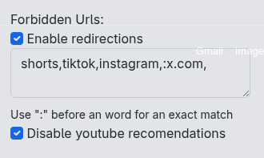

# Forbidden URLS
---
Extensão basica que redireciona o usuario pra fora de páginas definidas por ele,
com o objetivo de aumentar a produtividade

Também deixa a seção de recomendados do youtube invisível, junto com os comentarios dos videos

